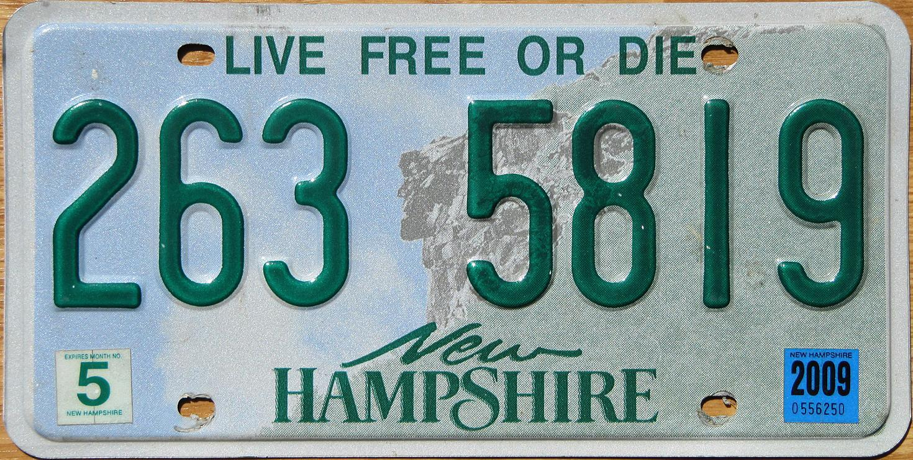

### *...or...*

### *The Tough Road Ahead for Howard Schultz* 

At the risk of losing half my readers in the first paragraph, I'll share my political views.  Generally, I believe in "free people and free markets."  That makes me a small-L libertarian.  I find it useful to think of, not a political spectrum from left to right, but a compass with four points.  People have distinct views on social issues that may be separate from their views on government's role in the economy.  The traditional political party platforms don't capture that nuance. There is no room in the Democratic or Republican Parties for a right-to-life person who also wants universal health care.

I have always assumed, that free of the shackles of traditional party labels, most Americans are tolerant of people with different lifestyles than their own.  At the same time we mostly believe that private markets do a better job of allocating resources than government bureaucrats.  *YOU* may not believe that but, as I said, that's been my working assumption about most people.  We lean libertarian under the skin.

Last week the founder of Starbucks announced his candidacy for President.  [This article](https://www.nytimes.com/2019/01/30/upshot/could-howard-schultz-help-re-elect-the-president.html) in the *New York Times* suggested he has centrist appeal but that group might be "smaller than he realizes."  The article goes on to say:

>These dissatisfied centrist voters fit the profile of affluent, socially moderate and fiscally conservative suburban voters. They are twice as likely to make more than $100,000 per year than voters who have a favorable view of a party, and 78 percent of these voters say Democrats “too often see government as the only way to solve problems.”

>Mr. Schultz could certainly play to these voters, but it is not a particularly electorally fruitful group. In an analysis of the Voter Study Group, Lee Drutman, a political scientist, found that just 4 percent of voters were conservative on economic issues and liberal on cultural issues. In comparison, populists represented 29 percent of the 2018 electorate. Mr. Schultz’s candidacy might be the reverse of Mr. Perot’s, but Mr. Perot’s pitch probably had broader appeal.

Then I read the [article by Lee Drutman](https://www.voterstudygroup.org/publications/2016-elections/political-divisions-in-2016-and-beyond) referenced by The Times and was discouraged to see little support for libertarian positioning in the 2016 survey of voters by [YouGov.com](YouGov.com).  Fortunately, the raw data is all available.  This survey was updated in December 2018 and the data can be found [here.](https://www.voterstudygroup.org/publications/2018-voter-survey/2018-voter-survey-top-lines).   

This  survey looked like the perfect opportunity to see if my sensibilities are widely shared.  In the process we will learn how to pick apart the VOTER data set. Any political junkie will find the huge number of questions a rich trove for exploration of all kinds. The survey results are a CSV file in a zipped package.  The file is in my Github repo but, as a matter of courtesy, *please request it from The Voter Study Group*, as their usage terms stipulate.

Start by loading in the raw data. As a matter of style, I like to keep a raw data frame in pristine form and manipulate a copy so if I mess up I can always restart the data munging from the same base.  If memory allows, additional intermediate versions might be helpful. As always, we will be working in the **Tidyverse** dialect.

```{r message=FALSE, warning=FALSE}
# load libararies and files
library(tidyverse)
library(knitr)
voter_18_raw <- read_csv("data/VOTER_Survey_April18_Release1.csv")
```
## Choose the Questions to Use

While Mr. Drutman's analysis of the survey did not show many libertarian-leaning voters, I hoped that selecting my own set of questions narrowly focused on the relevant issues might provide more support for my point of view.  So, to be honest, I went into this with a preconceived notion of the answer I wanted to get.  Beware.

Out of the dozens of questions the survey asked, I pulled out those which seemed to go to the separate dimensions of the conservative/liberal spectrum. The questions involved:

**Fiscal Issues**

  + Trust of the government in Washington
  + Amount of regulation of business by the government
  + Importance of reducing the federal deficit
  + Role of government in economy
  + Desired third party position on economic issues

**Social Issues**

  + Difficulty of foreigners to immigrate to US
  + Gender Roles "Women belong in the kitchen!"
  + Views about the Holy Scriptures of own religion, literal truth?
  + Opinion on gay marriage
  + Public restroom usage of transgender people
  + View on Abortion
  + Desired third party position on social and cultural issues

## Pull Out Demographic Features

Now we massage the raw data a few ways.  First we `gather()` the data to group the interesting demographic features as separate variables and tidy up all the remaining questions and answers into two variables.

```{r message=FALSE, warning=FALSE}


voter_18<- gather(voter_18_raw,"question","answer",
                  -caseid,
                  -pid3_2018,
                  -race_2018,
                  -gender_2018,
                  -faminc_new_2018,
                  -inputstate_2018
                  ) %>% 
  as_tibble() %>%
  filter(!is.na(caseid)) %>% 
  filter(!is.na(answer)) %>% 
  distinct()

# labels of the questions we want to keep, with a (f)iscal or (s)ocial tag
questions_to_keep <-  read_csv(
  "axis_flag,question\n
  f,trustgovt_2018\n
  s,immi_makedifficult_2018\n
  f,tax_goal_federal_2018\n
  f,govt_reg_2016\n
  s,sexism1_2018\n
  s,holy_2018\n
  s,gaymar_2016\n
  s,abortview3_2016\n
  s,third_soc_2018\n
  f,third_econ_2018\n
  f,gvmt_involment_2016\n",trim_ws=T)

voter_18 <- voter_18 %>% filter(question %in% questions_to_keep$question)

voter_18 <- voter_18 %>% mutate(answer=as.numeric(answer))
# make demographic variables factors
voter_18 <- voter_18 %>%
  mutate(caseid =as.character(caseid)) %>% 
  mutate(gender_2018=as.factor(gender_2018)) %>% 
  mutate(race_2018=as.factor(race_2018)) %>% 
  mutate(faminc_new_2018=as.factor(faminc_new_2018)) %>% 
  mutate(pid3_2018=as.factor(pid3_2018)) %>% 
  rename(party_2018=pid3_2018) %>% 
  rename(state_2018=inputstate_2018) %>% 
  rename(income_2018=faminc_new_2018)
  
#map state numbers to state abbreviations
state_plus <- c(state.abb[1:8],"DC",state.abb[9:50])
voter_18$state_2018 <- factor(voter_18$state_2018)
levels(voter_18$state_2018) <- state_plus


levels(voter_18$gender_2018) <- c("Male","Female")
levels(voter_18$race_2018) <- c("White","Black","Hispanic",
                                "Asian","Native Amerian","Mixed",
                                "Other","Middle Eastern")

levels(voter_18$party_2018) <- c("Democrat","Republican","Independent",
                                "Other","Not Sure")
#Make human-readable income column
income_key<-read_csv(
  "Response,Label\n
  1, Less than $10\n
  2, $10 - $19\n
  3,  $20 - $29\n
  4,  $30 - $39\n
  5,  $40 - $49\n
  6,  $50 - $59\n
  7,  $60 - $69\n
  8,  $70 - $79\n
  9,  $80 - $99\n
  10,   $100 - $119\n
  11,   $120 - $149\n
  12,   $150 - $199\n
  13,   $200 - $249\n
  14,   $250 - $349\n
  15,   $350 - $499\n
  16,   $500 or more\n
  97,   Prefer not to say\n"
  ,col_types = "ff",trim_ws = TRUE)

voter_18 <- voter_18 %>% mutate(income_2018_000=income_2018)
levels(voter_18$income_2018_000)<-levels(income_key$Label)

# now make income_2018 continuous again, keeping income_2018_000 as a factor
# for labeling
# "Decline to answer" (coded as 97) is set to NA.   
voter_18 <- voter_18 %>% mutate(income_2018=ifelse(income_2018==97,NA,income_2018)) %>%
                    mutate(income_2018=as.numeric(income_2018))
voter_18[1:10,]

# We did a lot of work.  Save it.
#save(voter_18,file="data/voter_18.rdata")
# free up 30mb of memory
rm(voter_18_raw)
```
Look at some of the demographics.
```{r}

demographics <- voter_18 %>% 
  distinct(caseid,.keep_all = TRUE) %>% 
  select(-question,-answer)

demographics %>% group_by(gender_2018) %>%
  summarise(count=n())
```
```{r}
demographics %>%
  ggplot(aes(race_2018))+geom_bar()+coord_flip()
```

## Rescale Answers for Consistency
The final step in massaging the data is to rescale all the question answers to between one and minus one, interpreted as liberal to conservative, respectively, in two dimensions. "Don't know" (usually coded as 8) is treated as neutral (zero). If the question is "fiscal", set "social" to `NA` and vice versa.
```{r}
#add two new columns to hold scaled answers.
voter_18_scaled<-voter_18 %>% mutate(fiscal=NA,social=NA)
# +1 is fiscal liberal
voter_18_scaled <- voter_18_scaled %>% 
  mutate(fiscal=ifelse(question=="trustgovt_2018",answer-2,fiscal))

# +1 is social liberal
voter_18_scaled <- voter_18_scaled %>%
  mutate(social=ifelse(question=="immi_makedifficult_2018",(answer-3)*-0.5,social))
voter_18_scaled <- voter_18_scaled %>%
  mutate(social=ifelse(question=="immi_makedifficult_2018",
                       ifelse(answer==8,0,social),social))

# +1 is fiscal liberal
voter_18_scaled <- voter_18_scaled %>%
  mutate(fiscal=ifelse(question=="tax_goal_federal_2018",(answer-2.5)*(2/3),fiscal))

# +1 is fiscal liberal
voter_18_scaled <- voter_18_scaled %>%
  mutate(fiscal=ifelse(question=="govt_reg_2016",(answer-2),fiscal))
voter_18_scaled <- voter_18_scaled %>%
  mutate(fiscal=ifelse(question=="govt_reg_2016",
                       ifelse(answer==8,0,fiscal),fiscal))

# +1 is social liberal
voter_18_scaled <- voter_18_scaled %>%
  mutate(social=ifelse(question=="sexism1_2018",(answer-2.5)*(2/3),social))

# +1 is social liberal
voter_18_scaled <- voter_18_scaled %>%
  mutate(social=ifelse(question=="holy_2018",(answer-2),social))

# +1 is social liberal
voter_18_scaled <- voter_18_scaled %>%
  mutate(social=ifelse(question=="gaymar_2016",(answer-1.5)*-2,social))
voter_18_scaled <- voter_18_scaled %>%
  mutate(social=ifelse(question=="gaymar_2016",
                       ifelse(answer==8,0,social),social))

# +1 is social liberal
voter_18_scaled <- voter_18_scaled %>%
  mutate(social=ifelse(question=="view_transgender_2016",(answer-1.5)*-2,social))
voter_18_scaled <- voter_18_scaled %>%
  mutate(social=ifelse(question=="view_transgender_2016",
                       ifelse(answer==8,0,social),social))

# +1 is social liberal
voter_18_scaled <- voter_18_scaled %>%
  mutate(social=ifelse(question=="abortview3_2016",(answer-2)*-1,social))
voter_18_scaled <- voter_18_scaled %>%
  mutate(social=ifelse(question=="abortview3_2016",
                       ifelse(answer==8,0,social),social))

# +1 is social liberal
voter_18_scaled <- voter_18_scaled %>%
  mutate(social=ifelse(question=="third_soc_2018",(answer-3)*-0.5,social))

# +1 is fiscal liberal
voter_18_scaled <- voter_18_scaled %>%
  mutate(fiscal=ifelse(question=="third_econ_2018",(answer-3)*-0.5,fiscal))

# +1 is fiscal liberal
voter_18_scaled <- voter_18_scaled %>%
  mutate(fiscal=ifelse(question=="gvmt_involment_2016",(answer-1)*-1,fiscal))
voter_18_scaled <- voter_18_scaled %>%
  mutate(fiscal=ifelse(question=="gvmt_involment_2016",
                       ifelse(answer==8,0,fiscal),fiscal))

# We did a lot of work.  Save it.
#save(voter_18_scaled,file="data/voter_18_scaled.rdata")

```
Now we have values that we can aggregate for each question. They are all normalized and given equal weight. Should each question be given equal weight?  I don't know, but now we can compute average scores for each `caseid` (voter) . We also add the demographic features to each observation.  So now every `caseid` in the survey is assigned and fiscal and social temperament score. 
```{r message=FALSE, warning=FALSE}
scores <- voter_18_scaled %>% 
  group_by(caseid) %>% 
  summarise(social=mean(social,na.rm = T),fiscal=mean(fiscal,na.rm = T)) %>% 
  left_join(demographics)   #Add demographics to scores
```
Let's start off at the highest level.  What are the mean values for each dimension?

```{r}
mean_social <- mean(scores$social,na.rm = T)
mean_fiscal <- mean(scores$fiscal,na.rm = T)
print(paste("Mean Fiscal=",round(mean_fiscal,2),
            "Mean Social=",round(mean_social,2)))
```
Well that is an encouraging start.  The signs are in the libertarian quadrant, anyway, but are they statistically significant?  Specifically, can we reject the hypothesis that the true mean is greater than zero for social, and less than zero for fiscal?
```{r}
t_s <-t.test(scores$social,mu=0,conf.level = 0.95,alternative="greater") %>% broom::tidy()
t_f <-t.test(scores$fiscal,mu=0,conf.level = 0.95,alternative="less") %>% broom::tidy()
t_both<-bind_cols(Dimension=c("Social","Fiscal"),bind_rows(t_s,t_f)) %>% 
  select(Dimension,estimate,statistic,conf99.low=conf.low,conf99.high=conf.high)
t_both

```

With such a large sample size we can be pretty confident that the true mean is close to the sample mean and therefore leans libertarian.  Alas, that is not enough to form an opinion.  The magnitudes are still very small and a slight relative shift in the aggregate may not support my hypothesis that most people have a libertarian bias when you break down the issues. Further, we haven't even touched on the survey methodology. It is an online survey and therefore means the respondents have computers and are facile with internet access. That population is closer and closer to "everyone" with each passing day but is still not universal.

With our data all cleaned up, let's look at some pictures!
```{r message=FALSE, warning=FALSE}
gg <- ggplot(scores,aes(fiscal,social)) + geom_point()
gg <- gg +  geom_jitter(width=0.05,height=0.05)
gg <- gg + geom_hline(yintercept = 0,color="red")
gg <- gg + geom_vline(xintercept = 0,color="red")
gg <- gg + annotate("text",label=c("Libertarian"),x=-0.9,y=0.9,color="red")
gg <- gg + labs(title="Separation of Social and Fiscal Values",
                y = "Social Score (Higher=More Liberal)",
                x = "Fiscal Score (Higher=More Liberal)")
gg <- gg + annotate("text",x=0.7,y=-1.0,color="red",
                    label=paste("Mean Fiscal=",round(mean_fiscal,2),
                                "Mean Social=",round(mean_social,2)))
gg + geom_smooth(method="lm")
```

The first thing to note is the values are all over the chart. We've added some random "jitter" noise to the position of each point with `geom_jitter()`.  Otherwise, many of the points would overlap and obscure the density of the points. Even so, careful scrutiny of of the standard error range around the regression line shows that a huge number of points lie very close to the line.

Sadly, for a libertarian, the scores tend to line up along the 45 degree axis, which means people who are more socially conservative are more likely to be fiscally conservative as well. The libertarian quadrant is the upper left, which is more sparsely populated.

```{r}
lm(scores$social~scores$fiscal) %>% broom::tidy()
```

Let's count voter incidence in each quadrant.

```{r}
#call zero scores "Neutral"
scores <- scores %>% 
  mutate(fiscal_label=cut(scores$fiscal,c(-1,-0.0001,0.0001,1),
                      labels=c("Conservative","Neutral","Liberal"))) %>% 
  mutate(social_label=cut(scores$social,c(-1,-0.01,0.01,1),
                      labels=c("Conservative","Neutral","Liberal")))

xtabs(~fiscal_label+social_label,scores) %>% 
  as_tibble() %>% 
  arrange(desc(n)) %>% 
  filter(fiscal_label != "Neutral",social_label != "Neutral")
```

The largest quadrant is Liberal/Liberal followed by Conservative/Conservative.  Leaving out the neutral axes, the libertarian quadrant (liberal social, conservative fiscal) is third with a respectable number of respondents. This is about 18% of the sample, far more than the 4% Mr. Drutman found.  The liberal fiscal, conservative social quadrant, which is populist I suppose, includes the fewest voters.

This is suggestive of traditional party platforms so how does this look broken out by party?
```{r message=FALSE, warning=FALSE}

gg <-ggplot(scores,aes(fiscal,social,color=party_2018))+geom_point()
gg <- gg +  geom_jitter(width=0.05,height=0.05)
gg <- gg + geom_hline(yintercept = 0,color="red")
gg <- gg + geom_vline(xintercept = 0,color="red")
gg <- gg + annotate("text",label=c("Libertarian"),x=-0.9,y=0.9,color="red")
gg <- gg + labs(title="Party Lines Align With Temperament",
                y = "Social Score (Higher=More Liberal)",
                x = "Fiscal Score (Higher=More Liberal)")
gg

```

There is a clear bifurcation around party, which is exactly what we'd expect.  

The survey respondents are overwhelmingly white. What does the plot look like if we remove them from data set?

```{r message=FALSE, warning=FALSE}
gg <- scores %>% filter(race_2018 != "White") %>% 
  ggplot(aes(fiscal,social,color=race_2018))+geom_point()
gg <- gg +  geom_jitter(width=0.05,height=0.05)
gg <- gg + geom_hline(yintercept = 0,color="red")
gg <- gg + geom_vline(xintercept = 0,color="red")
gg <- gg + annotate("text",label=c("Libertarian"),x=-0.9,y=0.9,color="red")
gg <- gg + labs(title="Minorities Are Not Too Different from Whites",
                y = "Social Score (Higher=More Liberal)",
                x = "Fiscal Score (Higher=More Liberal)")
gg

```

The sub sample above looks very similar to the whole data set.  Black voters do skew more to the Liberal/Liberal side but Hispanic voters do not.  

Let's meet some individuals.  Who are the folks who show strong libertarian sentiments (greater than 0.5 social, less than -0.5 fiscal), all nineteen of them?
```{r}
scores %>% filter(fiscal < (-0.5),social > (0.5)) %>% select(gender_2018,race_2018,party_2018,income_2018_000,state_2018)
```

These folks are almost all white, but it's a tiny sub sample so I doubt any generalizations are significant.  There is only one Democrat in the bunch.  They are not rich and they're spread around the country. They are men and women.

We have a number of additional demographic variables but let's just look at one more of them. How do scores look conditioned on income?

```{r message=FALSE, warning=FALSE}
gg <- scores %>% filter(!is.na(income_2018)) %>%
  ggplot(aes(income_2018_000,fiscal,group=income_2018)) + geom_boxplot()
gg <- gg + coord_flip() + theme(axis.text.x = element_text(angle=-90))
gg <- gg + geom_hline(yintercept = 0,color="red")
gg <- gg + labs(title="Higher Income Does  Not Make a Fiscal Conservative",
                x = "Annual Income ($000)",
                y = "Fiscal Score (Higher=More Liberal)")
gg
```

Surprisingly, to me, there is no trend to prefer less government as income rises.  The desire for government involvement in the economy is close to neutral across all income cohorts.  Note, I did not include any tax questions for this measure.  People are happy to favor higher taxes on anybody who makes more money than they do.
```{r message=FALSE, warning=FALSE}
gg <- scores %>% filter(!is.na(income_2018)) %>%
  ggplot(aes(income_2018_000,social,group=income_2018))+ geom_boxplot()

gg <- gg + coord_flip() + theme(axis.text.x = element_text(angle=-90))
gg <- gg + geom_hline(yintercept = 0,color="red")
gg <- gg + labs(title="Higher Income Does Make One More Socially Liberal",
                x = "Annual Income ($000)",
                y = "Social Score (Higher=More Liberal)")
gg
```

There is some association with more socially liberal views as income rises.  The richer you are, the more tolerant you are of other's lifestyles, I guess.  During the 2016 election there was some questioning around why poor people (mainly rural whites) voted "against their economic interest." This suggests that voting WITH their conservative social interests was more important (I am not saying that our current president embodies conservative social values, or any values at all).  This is relative.  In all income cohorts the median voter is at least a shade liberal on social issues.

How Much Does Location Matter?

Let's look at average scores by state.  To remind us of the influence that larger states have on the overall numbers we'll grab population data from the Census Bureau.  There are a number of R packages to access the census API but those are more than we need and require an API key.  Here, we'll just grab a summary CSV file from the web site.  
```{r}
# download population summary from census bureau
#state_pop_raw<-read_csv("https://www2.census.gov/programs-surveys/popest/datasets/2010-2018/national/totals/nst-est2018-alldata.csv")
#save(state_pop_raw,file="data/state_pop_raw.rdata")
load("data/state_pop_raw.rdata")
# filter to keep only state level data and add abbreviations
state_pop <- state_pop_raw %>% 
  transmute(state=NAME,population_2018=POPESTIMATE2018) %>%
  filter(state %in% c(state.name,"District of Columbia")) %>%
  bind_cols(state_2018=as_factor(state_plus))

gg <- scores %>% group_by(state_2018) %>% 
  summarize(fiscal=mean(fiscal,na.rm = T),social=mean(social,na.rm = T)) %>%
  left_join(state_pop, by = "state_2018") %>% 
  ggplot(aes(fiscal,social)) + geom_point(aes(color=population_2018,
                                              size=population_2018))
gg <- gg + ggrepel::geom_text_repel(aes(label=state_2018))
gg <- gg + scale_size(trans="log10",
                      labels=c("0","1 mm","3 mm","10 mm","30 mm","More"))
 gg <- gg + scale_color_gradient(trans="log10",
                                labels=c("0","1 mm","3 mm","10 mm","30 mm","More"))
gg <- gg + geom_hline(yintercept = 0)
gg <- gg + geom_vline(xintercept = 0)
gg <- gg + annotate("text",label=c("Libertarian"),x=-0.15,y=0.4)
gg <- gg + labs(title="Separation of Social and Fiscal Values",
                y = "Social Score (Higher=More Liberal)",
                x = "Fiscal Score (Higher=More Liberal)")

gg
```

If I had created this chart first I might have been excited.  It shows that the average voter in most states is in the libertarian quadrant.  That is NOT the same thing as saying most voters in the "libertarian" states are libertarian.  We already showed that the vast majority of voters fall outside the libertarian quadrant.  Still, there are some interesting things to note. The fiscal sentiments of New Hampshire voters are far different than their Vermont neighbors.  I don't see Bernie Sanders sporting this license plate:

{width=400px}

## My Last Attempt at Validation

I went through the *YouGov.com* survey and picked out the questions I feel are relevant, a highly subjective exercise. Even so,the results do not support my hope that maybe a plurality of people have libertarian sensibilities.  But there were hints that gave me some hope.

First, there is a clear yearning for a choice beyond the existing parties as this question shows:

*In your view, do the Republican and Democratic parties do an adequate job of
representing the American people, or do they do such a poor job that a third
major party is needed?*

|Count|Answer|
|------:|:----------------------|
| 1,851 | Do adequate job |
|4,036 | Third party is needed |

The fact that most people want another choice tells us nothing about what that choice is.  Another question does seem to suggest libertarian economic sentiment in excess of what the number of Republicans might indicate:

*In general, do you think there is too much or too little regulation of business
by the government?*

|Count|Answer|
|------:|:-----------|
3,473 | Too much
1,628 | About the right amount |
1,999 | Too little |
871 | Don't know |

Finally, there are two questions in the survey that go explicitly to the separation of social and fiscal values.

*1. If you were to vote for a new third party, where would you like it to stand on
social and cultural issues—like abortion and same-sex marriage?*

*2. If you were to vote for a new third party, where would you like it to stand on
economic issues—like how much the government spends and how many services it
provides?*

The range of answers for both is:

|Score| Answer |
|------:|:----------------------|
| 1.0 | More liberal than the Democratic Party|
| 0.5 | About where the Democratic Party is now|
| 0.0 | In between the Democratic Party and the Republican Party|
| -0.5 | About where the Republican Party is now|
| -1.0 | More conservative than the Republican Party|

Let's re-do the scatter based on the answers to just those two questions.  Since we are using only two questions with possible values of only 1,0 and minus 1, there are many more respondents than possible values.  Again we add some random jitter to make the density clear.  Every dot within each square is actually the same value. The result is a visual cross tab. I quite like the effect.
```{r message=FALSE, warning=FALSE}
scores_narrow <- voter_18_scaled %>% 
  filter(str_detect(question,"third_")) %>%  
  group_by(caseid) %>% 
  summarise(social=mean(social,na.rm = T),fiscal=mean(fiscal,na.rm = T)) %>% 
  left_join(demographics)

gg <- ggplot(scores_narrow,aes(fiscal,social,color=party_2018))+geom_point() + geom_jitter()
gg <- gg + geom_hline(yintercept = 0)
gg <- gg + geom_vline(xintercept = 0)
gg <- gg + labs(title="What Kind of Third Party Would Voters Prefer?",
                y = "Social Score (Higher=More Liberal)",
                x = "Fiscal Score (Higher=More Liberal)")
gg <- gg + annotate("text",label=c("Libertarian"),x=-0.9,y=0.9)
gg <- gg + annotate("text",label=c("Populist?"),x=0.9,y=-0.9)
gg <- gg + annotate("text",label=c("Left of Democrats"),x=0.9,y=0.9)
gg <- gg + annotate("text",label=c("Right of Republicans"),x=-0.9,y=-0.9)
gg

```

What I don't like is the result.  Contrary to my pre-conceived notion, it's clear the American electorate is not crypto-libertarian.  Rather, voters want a third party that is highly centrist or highly polarized along traditional liberal/conservative lines.  This makes it unlikely that any single third party could be successful at the ballot box.  Rather, both an extreme left-wing and an extreme right wing party could take votes away from the traditional parties. 

Could Howard Schulz be something of a spoiler from the center?  Possibly.  There are a large number of voters who would like an alternative that is less intrusive than the Democrats on economic issues and less intrusive than the Republicans on moral issues. I disagree with the Times' assessment that, since there are so few absolute libertarians, Schulz will not find a base.  As we see, there are many people who lean toward the center and away from the extremes within their parties, even if they are not libertarian, **per se**.

```{r}
tmp <-scores_narrow %>% 
  mutate(social_bucket=cut(social,breaks=c(-1.1,-.25,.25,1.1),
                    labels=c("Status Quo or More Right",
                    "To the Center",
                    "Status Quo or More Left"))) %>% 
  mutate(fiscal_bucket=cut(fiscal,breaks=c(-1.1,-.25,.25,1.1),
                    labels=c("Status Quo or More Right",
                    "To the Center",
                    "Status Quo or More Left")))


xtabs(~social_bucket+fiscal_bucket,tmp)
```


But, far too many people remain way out on the extremes to make this likely.

## Conclusion
I started this exercise hoping to find some support for my personal views among the broader electorate.  Sadly, I didn't find much.  The strongest statement I can make is there is a slight bias among both Republicans and Democrats for more centrist policies.  But the fun of data science is finding things you didn't expect and in validating or refuting hunches and feelings with good science. I know something today I didn't know yesterday so I'll call it a win!

```{r}
sessionInfo()
```

